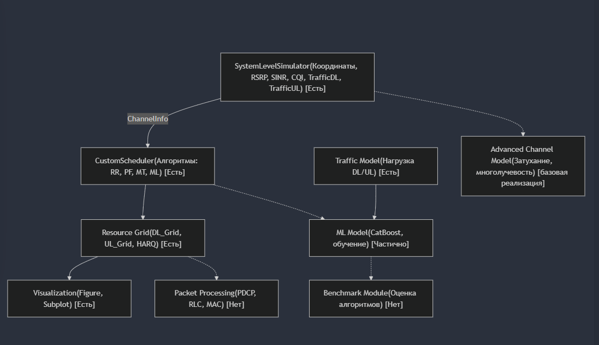

# Описание проекта: System-Level Simulator & Scheduler

## 1. Общая идея и назначение кода

Код предназначен для имитации (system-level simulation) работы беспроводной сети (примерно LTE/5G), где есть:

### Симулятор (класс `SystemLevelSimulator`), отвечающий за:
- **Расположение базовой станции (gNB) и пользователей (UE).**
- **Моделирование движения пользователей и обновление их координат.**
- **Расчёт параметров канала (RSRP, SINR, CQI).**
- **Выдачу «канальной информации» (ChannelInfo) планировщику.**

### Планировщик (класс `CustomScheduler`), который:
- **Принимает данные о канале (CQI, RSRP и т.п.).**
- **Выполняет распределение ресурсов (ресурсных блоков, RB) между пользователями на восходящей (UL) и нисходящей (DL) линиях.**
- **Поддерживает различные алгоритмы планирования:**
 - RoundRobin
 - ProportionalFair
 - MaxThroughput
 - (опционально) ML-алгоритм (CatBoost)
- **Ведёт HARQ-процессы, может логировать результаты, собирать данные для обучения и т.д.**

### Главный скрипт (после объявления классов), который:
- Инициализирует симулятор и планировщик.
- Запускает цикл по времени (simTime шагов).
- На каждом шаге определяет, идёт ли DL или UL слот (через tddConfig).
- Вызывает методы планировщика (`scheduleDL` или `scheduleUL`), а затем обновляет визуализацию.

Таким образом, проект демонстрирует базовый каркас системы, где можно экспериментировать с разными алгоритмами планирования (RR, PF, MT, ML), отслеживать показатели канала и визуализировать ресурсные сетки (какие RB кому выделены).

## 2. Класс SystemLevelSimulator

### Основные моменты

**Свойства:**
- `NumUEs` — число пользователей.
- `Bandwidth` — полоса частот (Гц).
- `SCS` — Subcarrier Spacing (например, 30 кГц).
- `NumRBs` — количество ресурсных блоков (RB), рассчитывается как `floor(bw / (12 * scs))`.
- `SimTime` — общее время симуляции.
- `UELocations` — координаты всех пользователей.
- `RSRP`, `SINR`, `CQI_DL`, `CQI_UL` — параметры канала для каждого пользователя.
- `gNBLocation` — координаты базовой станции.
- `ChannelInfo` — структура, содержащая RSRP, CQI_DL, CQI_UL для передачи планировщику.
- `MovementStep` — определяет, насколько «быстро» двигаются пользователи (случайным образом).

**Методы:**
- **Конструктор** `SystemLevelSimulator(numUEs, bw, scs, simTime)`:  
  Инициализирует ключевые параметры, вычисляет количество RB, задаёт положение gNB, вызывает `initializeUE()` и `updateChannelConditions()`.
- **initializeUE()**:  
  Случайным образом распределяет пользователей в заданной зоне (например, 500×500 м).
- **updateNetwork(t)**:  
  На каждом шаге двигает пользователей (случайный угол, фиксированная длина шага) и снова вызывает `updateChannelConditions()` для пересчёта RSRP, SINR и CQI.
- **updateChannelConditions()**:
 - Вычисляет расстояние `d` от UE до gNB.
 - Рассчитывает RSRP по формуле `-112 - 35*log10(d + 1)`.
 - Вычисляет шумовой фон (noiseFloor) и на его основе SINR.
 - Переводит SINR в CQI (через `discretize` с порогами).

**Результат:**  
`SystemLevelSimulator` на каждом шаге даёт актуальные координаты пользователей и параметры канала, необходимые планировщику.

## 3. Класс CustomScheduler

### 3.1. Свойства

**Параметры сети:**
- `NumRBs`, `NumUEs`, `SchedulerType` (тип алгоритма), `SymbolsPerSlot`.

**Ресурсные сетки:**
- `DL_Grid` и `UL_Grid`: трёхмерные массивы [символы × RB × UE]. Хранят «код MCS» (или 0, если блок не выделен).

**Состояние:**
- `AvgThroughput` — вектор со средней пропускной способностью (для PF-алгоритма).
- `CQI_DL`, `CQI_UL` — текущее CQI для каждого UE.
- `HARQ_Processes` — структура для хранения состояний HARQ.
- `enableLogging` — флаг для вывода логов.

**ML-свойства (для CatBoost):**
- `mlEnabled`, `trainingData`, `predictionCache`.

### 3.2. Основные методы

- **Конструктор** `CustomScheduler(numRBs, numUEs, type, cqi_dl, cqi_ul)`:  
  Сохраняет входные параметры, инициализирует сетки `DL_Grid` и `UL_Grid` нулями, задаёт `AvgThroughput` и создаёт структуру HARQ-процессов.
- **Методы получения «2D-сеток»:**  
  `getDLResourceGrid` и `getULResourceGrid` — упрощённый вывод, где каждая ячейка (UE, RB) помечена, был ли ресурс выделен.
- **Методы планирования:**
 - `scheduleDL(channelInfo, t)` и `scheduleUL(channelInfo, t)`:
  - Обнуляют сетку DL/UL.
  - Вызывают конкретный алгоритм (RoundRobin, ProportionalFair, MaxThroughput или ML — CatBoost) в зависимости от `SchedulerType`.
  - Логируют результат (если включено) и обрабатывают HARQ.
 - В зависимости от `SchedulerType` вызываются:
  - `roundRobinDL(t)` / `roundRobinUL(t)`
  - `proportionalFairDL(channelInfo)` / `proportionalFairUL(channelInfo)`
  - `maxThroughputDL(channelInfo)` / `maxThroughputUL(channelInfo)`
  - `mlBasedScheduler(channelInfo)`, если тип задан как CatBoost.

**Кратко о реализованных алгоритмах:**
- **RoundRobin:** Равномерно делит RB между всеми UE по очереди.
- **ProportionalFair:** Сортирует пользователей по метрике `\(\frac{RSRP+120}{AvgThroughput}\)`, выделяет блоки тем, у кого лучшее отношение RSRP к текущей пропускной способности, и обновляет `AvgThroughput`.
- **MaxThroughput:** Сортирует пользователей по CQI (или RSRP) и выделяет RB пользователям с лучшим каналом.
- **ML (CatBoost):** Вызывает метод `predictWithCatboost(channelInfo)` для получения решения (матрица 0/1, где 1 означает выделение RB) и сохраняет данные в `trainingData`.

**Логирование и HARQ:**
- `logSchedule(direction, t)` выводит информацию о выделенных RB и используемом MCS для каждого UE.
- Методы `processHARQFeedback()` и `retransmitProcess(processID)` реализуют простую схему повторной передачи при NACK(если статус «NACK», идёт повторная передача).

**Вспомогательные методы:**  
- `allocateRB(availableRBs)` : случайно выбирает подряд идущие RB (не более 12).
- `collectTrainingData()`, `saveTrainingData()`: сбор/сохранение данных для обучения ML.
- `getMCS(cqi)`: возвращает структуру с `code` и `efficiency` на основе таблицы MCS (TS 38.214).

## 4. Главный скрипт

После объявления классов идёт основной код, который:
1. **Задаёт параметры симуляции:**
 - `simTime`, `numUEs`, `bandwidth`, `scs`, `tddConfig`.
2. **Создаёт объекты:**
 - `SystemLevelSimulator` и `CustomScheduler`.
3. **Настраивает визуализацию:**
 - Отображаются позиции UE и базовой станции, рисуются линии соединения.
 - Используются два графика (`imagesc`) для ресурсных сеток DL и UL (цвет показывает, какие RB выделены).
4. **Запускает цикл по времени** `for t = 1:simTime`:
 - Определяется тип слота (DL или UL) по `tddConfig`.
 - Вызывается `simulator.updateNetwork(t)` для обновления позиций и канальных условий.
 - Вызывается соответствующий метод планировщика (`scheduleDL` или `scheduleUL`).
 - Обновляется визуализация (позиции UE, линии, ресурсная сетка).
 - (При необходимости) каждые 10 итераций сохраняются данные для ML, если используется CatBoost.

Таким образом, получается пошаговая анимация: пользователи двигаются, меняются канальные условия, а планировщик распределяет ресурсы в зависимости от выбранного алгоритма.

## 5. Примерная структура проекта (блок-схема)

                       ┌─────────────────────────┐
                       │  SystemLevelSimulator   │
                       │ (координаты, RSRP, SINR,│
                       │  CQI_DL, CQI_UL, ... )  │
                       └────────────┬────────────┘
                                    │  ChannelInfo (RSRP, CQI и т.п.)
                                    │
                     ┌──────────────▼────────────────┐
                     │       CustomScheduler         │
                     │ (выбирает алгоритм планирования│
                     │  RR, PF, MT или CatBoost)      │
                     └──────────────┬─────────────────┘
                                    │
    ┌───────────────────────────────┴───────────────────────────────┐
    │                 Сетки ресурсов DL/UL (DL_Grid, UL_Grid)      │
    │       (распределение RB между UE, хранение MCS, HARQ)        │
    └───────────────────────────────┬───────────────────────────────┘
                                    │
                                    │ (информация о выделенных RB)
                                    ▼
                     ┌────────────────────────────────────────────┐
                     │    Визуализация (figure, subplot, ... )   │
                     │ (позиции UE, RSRP, DL/UL-ресурсные сетки)  │
                     └────────────────────────────────────────────┘

**Пояснения:**
- `SystemLevelSimulator` генерирует ChannelInfo (RSRP, CQI_DL, CQI_UL) и передаёт их планировщику.
- `CustomScheduler` (в зависимости от выбранного алгоритма) выдаёт распределение RB в сетках `DL_Grid`/`UL_Grid`.
- Результаты отображаются в визуализации (положение UE, распределение RB).
- Внутри планировщика ведётся обработка HARQ, логирование и опционально применяется ML (CatBoost).

## 6. Что уже реализовано и возможное расширение

**Реализовано:**
- Базовый системный симулятор (движение UE, расчет канала, CQI).
- Планировщик с классическими алгоритмами (RR, PF, MT) и заготовкой под ML (CatBoost).
- Визуализация позиций UE и распределения ресурсных блоков.
- Простейшая реализация HARQ и сбор данных для обучения ML.

**Возможные улучшения:**
- Добавление трафик-модели (Traffic Models) для генерации реальной нагрузки (DL/UL).
- Усложнение канальной модели (учет затухания, многолучевости, корреляций).
- Создание Benchmark-модуля для сравнения алгоритмов по метрикам (throughput, BLER, задержка и т.д.).
- Расширение ML-модуля (дополнительные модели, полноценный цикл обучения).
- Внедрение логики QoS: приоритеты трафика, гарантированная полоса для определённых пользователей.
- Реализация обработки пакетов (буферы, очереди) и деталей протоколов передачи данных (PDCP/RLC/MAC).

## 7. Итоговое описание

Имеющийся код — это прототип системного уровня симулятора LTE/5G, где:
- **SystemLevelSimulator** моделирует пространство (например, 500×500 м), движение пользователей, а также рассчитывает параметры канала (RSRP, SINR, CQI).
- **CustomScheduler** получает эти данные и распределяет ресурсные блоки (RB) между пользователями с использованием различных алгоритмов планирования, включая возможность применения ML (CatBoost).
- Главный скрипт организует временной цикл, переключает TDD-слоты (DL/UL), обновляет канальные условия и визуализирует результат.

С помощью этого кода можно экспериментировать с алгоритмами планирования, наблюдать динамику распределения ресурсов и расширять систему для более сложных сценариев.

## 8. Схема реализации

